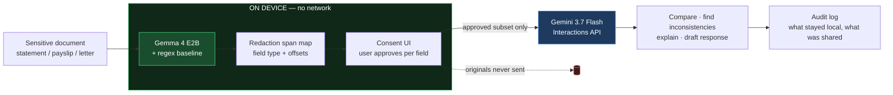

# Privacy Gate

A consent-aware document agent: a local model redacts sensitive material on-device, you
approve exactly what may leave, and only the approved subset reaches the cloud.

> **Working direction as of 13:30 — not final.**
> **Start here:** [visual explainer](docs/visual/2026-08-22-privacy-gate.html) — diagrams,
> worked example, who-builds-what (open it in a browser).
> Full write-up and scope: [`notes/ideas/privacy-gate.md`](notes/ideas/privacy-gate.md).

**UK AI Agent Lab: Gemini Edition** · Imperial College London · 22 August 2026
**Track:** 3 — Best Hybrid AI & Human-Centric Utility

## The problem

_TODO — two sentences. Who has this problem, and what does it cost them today?_

## What it does

- **You drop in a sensitive document.** Gemma 4 runs locally and marks every name,
  address, account number and sensitive field it finds. Nothing has left the machine.
- **You approve what may be shared**, field type by field type — "share income, hide
  identity and account details".
- **Gemini 3.7 Flash reasons over the approved subset only**: compares documents, finds
  inconsistencies, explains it plainly, drafts what you need.
- **An audit trail shows exactly what stayed local and what was shared.**

## Architecture



**Why this split:** the boundary is the product. Redaction has to happen before the data
leaves, so it must run locally — that is the whole guarantee. Everything downstream is
cross-document reasoning over an already-sanitised payload, which is exactly what a fast
frontier model is for and carries no privacy cost once the originals are gone. Gemma is
asked for a structured span map rather than prose, which keeps its output short enough to
stay fast on modest hardware.

## Model integration

Submission rules require explicit proof of model use. Point at the real lines:

| Model | Where | What it does |
|---|---|---|
| **Gemini 3.7 Flash** | `app/pipeline.py` → `gemini_step()` | Cross-document reasoning, inconsistency detection, plain-language explanation, drafting |
| **Gemma 4 (E2B, local)** | `app/pipeline.py` → `local_step()` | On-device detection and classification of sensitive fields, before anything is sent |

Gemini is called through the Google GenAI SDK (`google-genai`) using the **Interactions
API**, which has been GA and recommended since June 2026. Gemma 4 runs locally through
Ollama, so that path works with the network off.

## Quickstart

```bash
git clone <THIS_REPO_URL>
cd imperial-deepmind-hackathon

python3 -m venv .venv
.venv/bin/pip install -r starter/requirements.txt

cp starter/.env.example .env        # then paste your key into .env
# get a key at https://aistudio.google.com/apikey

# local model (needed for the Gemma path)
ollama pull gemma4:e2b

.venv/bin/python app/main.py "your input here"
```

Verify the setup before building on it:

```bash
.venv/bin/python starter/01_hello_gemini.py     # cloud path
.venv/bin/python starter/07_local_gemma.py      # local path, works offline
```

## Measured performance

Benchmarked on the build machine (Apple M1, 16 GB), thinking disabled:

| Model | Rate | Cold load |
|---|---|---|
| `gemma4:e2b` | 10.8 tok/s | 21 s |
| `gemma4:e4b` / `:latest` | 4.7 tok/s | 108 s |

Use **E2B** locally, keep it warm before any demo, and keep local outputs short. Full
detail in [`notes/MEASURED-on-device-reality.md`](notes/MEASURED-on-device-reality.md).

## Repo layout

```
app/          the project itself
starter/      9 verified reference scripts for both models
docs/         event ground truth, model references, strategy  (see docs/README-warroom.md)
notes/        working notes, measurements, idea shortlists
SUBMISSION.md the required write-up + video link
```

## Limitations

_TODO — state these honestly. Judges ask, and an honest answer defends better than a
vague one. What doesn't work yet, what's stubbed, what you'd fix first._

## Team

_TODO — names and GitHub handles._

## Licence

Apache-2.0. See [LICENSE](LICENSE).
