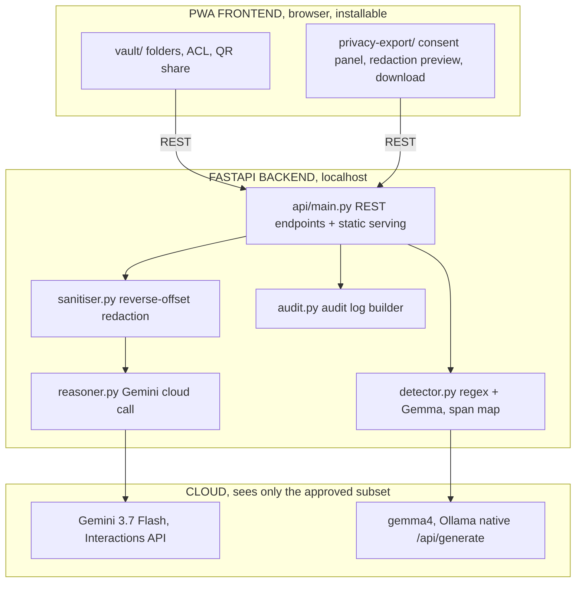

# Privacy Gate

A consent-aware document agent. A local model finds the sensitive fields in a document,
you approve exactly what may leave field type by field type, and only the approved
subset ever reaches the cloud. Every field carries an audit trail: what stayed local,
what was shared, and why.

**UK AI Agent Lab: Gemini Edition** · Imperial College London · 22 August 2026
**Track:** 3, Best Hybrid AI & Human-Centric Utility

## The problem

Sharing a payslip or bank statement to prove income, dispute a bill, or ask for help
means handing over a document full of things the recipient doesn't need: your national
insurance number, your full address, your account number, a signature. Today that's an
all-or-nothing choice, so people either overshare or don't share at all. Privacy Gate
turns it into a field-by-field decision with a record of what was decided.

## What it does

- **Drop in a document.** Detection runs on the fields, combining regex for the
  deterministic cases (account numbers, postcodes, National Insurance numbers, emails)
  with a language model for the fields regex cannot see, names in context, free-text
  disclosure, signatures.
- **Approve what may leave, field type by field type**, with three states per field: keep
  it visible, blacklabel it, or encrypt it into a passphrase-locked vault kept in the
  export. Nothing is ever auto-published; a human decides on every field before anything
  becomes shareable.
- **Gemini 3.7 Flash reasons over the approved subset only.** It compares documents,
  flags inconsistencies, and drafts a response, never seeing a field you didn't approve.
- **An audit trail records exactly what happened**: which fields were shared, which were
  kept local, and whether the detector fell back to regex-only because the model was
  unavailable.
- **Every export outlives the app.** Sanitised HTML, plain text, `audit.json`, a zip, and
  an encrypted vault for locked fields, all ordinary files that open anywhere.

## Architecture



**Why this split:** the consent gate is the defensible part of the product, not the fact
that redaction happens before a cloud call. Detection produces a span map (field type
plus offsets); the user approves or rejects each field type; only the approved text is
assembled into a sanitised payload and sent for reasoning. The redaction step is useful
on its own, with or without a Gemini call ever happening. See
[`docs/specs/architecture.md`](docs/specs/architecture.md) for the full spec and
[`docs/decisions/`](docs/decisions/index.md) for the algorithm-level ADRs (span merge,
best-match offset resolution, the regex fallback).

## Model integration

| Model | Where | What it does |
|---|---|---|
| **Gemini 3.7 Flash** | `app/reasoner.py` → `reason()` | Cross-document reasoning over the sanitised payload only: inconsistency detection, plain-language explanation, drafting. Called via the Google GenAI SDK's Interactions API. |
| **Gemma 4** | `app/detector.py` → `_detect_gemma()` | Free-text field detection that regex cannot do: names in context, signatures, disclosure. Called through Ollama's native `POST /api/generate` (not the OpenAI-compatible `/v1` route, which silently ignores `think: false`), with `think: false` and a capped output length. |

The model tag actually in use is `gemma4:31b-cloud`, not a locally-pulled model. A
locally-pulled `gemma4:e2b` was the original plan, but it was never pulled on the build
machine and the pull's ETA (about 44 minutes) didn't fit the deadline, so the build
switched to Ollama's cloud-routed tag instead, verified live: a one-word structured
reply in 0.38 seconds, and a full 9-field detection pass over a sample payslip in 0.84
seconds. This is a code-path-identical swap (same native route, same request shape,
only the model name changed) documented in
[`.claude/skills/privacy-gate/SKILL.md`](.claude/skills/privacy-gate/SKILL.md). Because
the model call now leaves the machine, the honest claim is "regex runs fully on-device;
field detection combines that with a cloud-routed model", not "nothing leaves the
machine until you approve it", full stop. A deterministic regex layer sits under the
model regardless and catches the structured cases (account numbers, National Insurance
numbers, postcodes, emails, phone numbers) with no network dependency at all.

## Quickstart

```bash
git clone <THIS_REPO_URL>
cd imperial-deepmind-hackathon

python3 -m venv .venv
source .venv/bin/activate
pip install -r starter/requirements.txt
pip install fastapi "uvicorn[standard]" httpx pytest pytest-asyncio

cp starter/.env.example .env        # then paste your key into .env
# get a key at https://aistudio.google.com/apikey

# run the test suite (all external calls are mocked)
pytest app/tests/ -v

# start the server
uvicorn app.api.main:app --port 8000
# open http://localhost:8000  (redirects to /vault/)
```

The Gemma path calls out to a local Ollama instance (`OLLAMA_HOST`, default
`http://localhost:11434`) using whichever model tag `LOCAL_MODEL` names (default
`gemma4:31b-cloud`). If Ollama isn't running or the model isn't pulled, detection falls
back to regex-only automatically and the audit trail records that it did.

## Measured performance

Measured on the build machine (Apple M1, 16 GB), 22 August 2026, by running the actual
endpoints, not estimated:

| Call | Measured |
|---|---|
| `gemma4:31b-cloud`, one-word structured reply | 0.38 s |
| `/api/detect`, full 9-field payslip, live | 0.84 s |
| `/api/reason`, Gemini 3.7 Flash, live | 4.77 s |

Earlier in the build, a locally-pulled `gemma4:latest` (same blob as `gemma4:e4b`) was
measured at 4.7 tokens/second with a 65-second cold load, too slow for a live demo of
more than a short label. That measurement, and the reasoning behind moving off a
local pull entirely, are in
[`notes/MEASURED-on-device-reality.md`](notes/MEASURED-on-device-reality.md).

## Repo layout

```
app/
  detector.py       regex + Gemma detection, span merge, offset resolution
  sanitiser.py       reverse-offset redaction into a sanitised payload
  reasoner.py         Gemini cloud call
  audit.py            audit log builder
  fixtures.py          synthetic demo documents (never real personal data)
  types.py             shared data contracts
  api/                 FastAPI app: REST endpoints + static serving
  export/               download path: redact-to-zip, encrypted vault (existing module)
  access/                vault, ACL, QR share, instant transfer (existing module)
  static/                 PWA frontend: vault/, privacy-export/, theme/
  tests/                   pytest suite, one file per module, plus an end-to-end test
starter/              9 verified reference scripts for both models
docs/                 specs, architecture, ADRs, event ground truth
notes/                working notes and measurements
SUBMISSION.md         the required write-up and video link
```

## Limitations

Said plainly, because judges ask and an honest answer defends better than a vague one:

- **Detection is not guaranteed complete.** Regex catches the structured cases reliably;
  the language model catches most free-text cases but can miss unusual phrasing. That is
  exactly why every field is shown to the user for approval before anything leaves,
  never auto-published.
- **The Gemma call is now cloud-routed**, not literally on-device, for the reason above.
  The regex layer still runs fully locally with no network dependency.
- **The API is stateless and has no auth.** It's built for a single local user on
  `localhost`; nothing here is hardened for multi-tenant or internet-facing deployment.
- **The PWA offline story covers the UI shell only.** Detection and reasoning both need
  the FastAPI server reachable; only the static shell (manifest, service worker) loads
  with no network.
- **Two synthetic fixture documents ship with the demo.** Real-document robustness
  (varied formats, scanned images, handwriting) is future work, not validated here.

## What's next

1. Broaden detection beyond the two synthetic fixtures to arbitrary uploaded documents,
   including image/PDF ingestion through Gemma's vision path (`images: [base64]` on the
   native Ollama route).
2. Bring the local model back fully on-device once a smaller pulled model is verified
   fast enough on this hardware, restoring the stronger "nothing leaves the machine
   until you approve it" claim.
3. Add per-field confidence surfaced in the consent UI, so a low-confidence detection
   gets flagged for extra scrutiny rather than presented with the same weight as a
   regex-certain match.

## Team

- Talha Mansoor
- Supavich Aussawaauschariyakul ([@supawichza40](https://github.com/supawichza40))
- Reece Rodrigues

## Licence

Apache-2.0. See [LICENSE](LICENSE).
