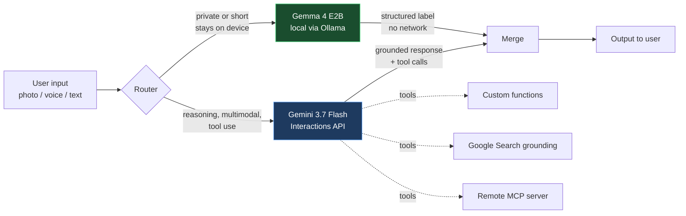

# PROJECT_NAME

> **TODO before 17:30 — replace `PROJECT_NAME` and this line with a one-sentence description
> of what this does. Under 20 words. This is the first thing a judge reads.**

**UK AI Agent Lab: Gemini Edition** · Imperial College London · 22 August 2026
**Track:** _TODO — 1 (Gemini 3.7 Flash) / 2 (Gemma 4 local) / 3 (Hybrid)_

## The problem

_TODO — two sentences. Who has this problem, and what does it cost them today?_

## What it does

_TODO — the core user flow, in three bullets. What the user does, what the system does,
what they get back._

- 
- 
- 

## Architecture



**Why this split:** _TODO — one paragraph. The honest engineering reason each model is
where it is. This is a scored write-up field, not decoration._

## Model integration

Submission rules require explicit proof of model use. Point at the real lines:

| Model | Where | What it does |
|---|---|---|
| **Gemini 3.7 Flash** | `app/pipeline.py` → `gemini_step()` | _TODO_ |
| **Gemma 4 (E2B, local)** | `app/pipeline.py` → `local_step()` | _TODO_ |

Gemini is called through the Google GenAI SDK (`google-genai`) using the **Interactions
API**, which has been GA and recommended since June 2026. Gemma 4 runs locally through
Ollama, so that path works with the network off.

## Quickstart

```bash
git clone <THIS_REPO_URL>
cd imperial-deepmind-hackathon

python3 -m venv .venv
.venv/bin/pip install -r starter/requirements.txt

cp starter/.env.example .env        # then paste your key into .env
# get a key at https://aistudio.google.com/apikey

# local model (needed for the Gemma path)
ollama pull gemma4:e2b

.venv/bin/python app/main.py "your input here"
```

Verify the setup before building on it:

```bash
.venv/bin/python starter/01_hello_gemini.py     # cloud path
.venv/bin/python starter/07_local_gemma.py      # local path, works offline
```

## Measured performance

Benchmarked on the build machine (Apple M1, 16 GB), thinking disabled:

| Model | Rate | Cold load |
|---|---|---|
| `gemma4:e2b` | 10.8 tok/s | 21 s |
| `gemma4:e4b` / `:latest` | 4.7 tok/s | 108 s |

Use **E2B** locally, keep it warm before any demo, and keep local outputs short. Full
detail in [`notes/MEASURED-on-device-reality.md`](notes/MEASURED-on-device-reality.md).

## Repo layout

```
app/          the project itself
starter/      9 verified reference scripts for both models
docs/         event ground truth, model references, strategy  (see docs/README-warroom.md)
notes/        working notes, measurements, idea shortlists
SUBMISSION.md the required write-up + video link
```

## Limitations

_TODO — state these honestly. Judges ask, and an honest answer defends better than a
vague one. What doesn't work yet, what's stubbed, what you'd fix first._

## Team

_TODO — names and GitHub handles._

## Licence

Apache-2.0. See [LICENSE](LICENSE).
