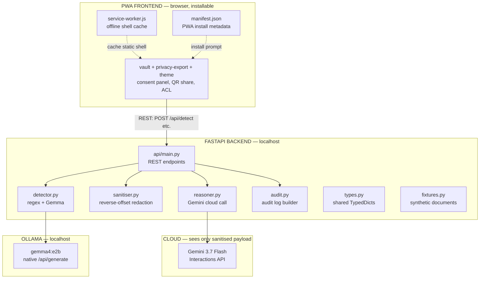

# Privacy Gate — Architecture Spec

**What this is:** system architecture for the Privacy Gate web application with PWA support.
**Implements:** [requirements spec](privacy-gate.md), [design doc](design.md).
**Supersedes:** ADR-003 (Streamlit) — see ADR-010.

---

## 1. Architecture overview



**Key change from design doc:** the Streamlit monolith is replaced by a FastAPI backend serving a static PWA frontend. The core Python modules (detector, sanitiser, reasoner, audit, types, fixtures) are unchanged — they are pure functions that the API layer calls.

**Why:** A web app with PWA support is installable, works offline (the static shell), and is a more impressive demo than a Streamlit script. The backend/frontend split also makes the API testable in isolation — critical for TDD.

---

## 2. Process model

```
User's machine:
  ┌─────────────────────────────────────────────┐
  │  Browser (PWA)                              │
  │    /vault/  /privacy-export/  /theme/       │
  │    PrivacyExport + PrivacyVault (plain JS)  │
  │    service-worker.js (caches static shell)  │
  │    manifest.json (PWA metadata)             │
  └──────────────┬──────────────────────────────┘
                 │ HTTP (localhost:8000)
  ┌──────────────▼──────────────────────────────┐
  │  FastAPI server (uvicorn)                   │
  │    Serves: static files + /api/* endpoints  │
  └──────┬───────────────┬──────────────────────┘
         │               │
  ┌──────▼─────┐  ┌──────▼──────────────────────┐
  │  Ollama    │  │  Gemini API (cloud)         │
  │  :11434    │  │  via google-genai SDK       │
  │  (local)   │  │  (sanitised payload only)   │
  └────────────┘  └─────────────────────────────┘
```

- **Single process:** FastAPI serves both static files (frontend) and API endpoints from one `uvicorn` process.
- **No separate frontend build step.** Plain HTML/CSS/JS — no React, no bundler, no npm. This is a 2-hour build.
- **PWA:** manifest.json + service worker enable "Add to Home Screen" and offline static shell caching. The API calls still require localhost connectivity (Ollama + FastAPI), but the UI shell loads without network.

---

## 3. Directory structure

```
app/
├── types.py              # Shared TypedDicts
├── fixtures.py           # Synthetic documents
├── detector.py           # Regex + Gemma detection
├── sanitiser.py          # Reverse-offset redaction (optional — browser does client-side)
├── reasoner.py           # Gemini cloud call
├── audit.py              # Audit log builder
├── main.py               # CLI entry point (kept for headless testing)
├── export/               # Export zip + redaction (built by teammate)
│   ├── redact.py          # apply_export — █ blacklabel + [ENCRYPTED] 
│   ├── fields.py          # 9 field types, default_toggles
│   ├── pack.py            # build_zip_bytes
│   ├── crypto.py          # AES-GCM, PBKDF2
│   └── sample.py          # Canonical payslip fixture
├── access/               # Vault, ACL, QR share (built by teammate)
│   ├── acl.py             # Role ladder, inheritance
│   ├── share.py           # Signed pointer (#s=)
│   ├── transfer.py        # Instant transfer (#t=) gzip JSON
│   ├── totp.py            # TOTP for two-step delete
│   └── store.py           # Vault state
├── api/
│   ├── __init__.py
│   ├── contracts.py       # Pydantic models (shared with frontend mock builder)
│   └── main.py            # FastAPI app: static files + REST endpoints
├── static/                # Multi-page frontend (ADR-013)
│   ├── vault/             # /vault/ — folder management, ACL, QR share
│   │   ├── index.html
│   │   ├── vault.js        # PrivacyVault.mount
│   │   ├── qr.js           # PrivacyQr.svg
│   │   └── qrcodegen.js    # Nayuki QR encoder
│   ├── privacy-export/    # /privacy-export/ — consent panel, redaction preview
│   │   ├── index.html
│   │   ├── privacy-export.js  # PrivacyExport.mount
│   │   └── demo-payload.js    # window.PRIVACY_EXPORT_DEMO
│   ├── theme/             # /theme/ — design tokens (not a product screen)
│   │   ├── tokens.js
│   │   ├── tokens.css
│   │   └── components.css
│   ├── manifest.json      # PWA install metadata
│   ├── service-worker.js  # Offline shell cache (scope: /)
│   └── icons/
│       ├── icon-192.png
│       └── icon-512.png
└── tests/
    ├── __init__.py
    ├── conftest.py
    ├── test_detector.py
    ├── test_sanitiser.py
    ├── test_reasoner.py
    ├── test_audit.py
    ├── test_api.py
    └── test_e2e.py
```

**Key points:**
- Core modules (`types.py` through `audit.py`) are unchanged from the design doc — pure functions, no web framework dependency.
- `api/main.py` is the only new Python code — a thin FastAPI wrapper that calls the existing modules.
- `static/` is the PWA frontend — plain HTML/CSS/JS, no build step.
- `tests/` is first-class — TDD means tests are written before implementation.

---

## 4. Layer responsibilities

### 4.1 Frontend (PWA) — `static/`

| Component | Responsibility |
|---|---|
| `static/vault/` | Folders, ACL, lock, two-step delete, `#t=` QR share, guest open |
| `static/privacy-export/` | Consent panel (`PrivacyExport.mount`), preview, HTML/txt/audit download |
| `static/theme/` | Tokens and controls. Not a product screen |
| `manifest.json` | PWA metadata: name, icons, display mode, theme colour |
| `service-worker.js` | Cache vault + export + theme shells. Scope at `/` |

**Frontend state:** vault state in `localStorage["pg-vault-v1"]`. Export toggles live on the mounted panel (`el._toggles`, `el._result`). Detect/reason results, when FastAPI exists, live in page JS.

Redaction is **client-side** (ADR-013). The browser never sends original document text to Gemini. It may send original text to `POST /api/detect` on localhost.

### 4.2 API layer — `api/main.py`

| Endpoint | Method | Purpose | Spec FR |
|---|---|---|---|
| `/` | GET | Redirect to `/vault/` | — |
| `/vault/` | GET | Vault page | — |
| `/privacy-export/` | GET | Export panel | — |
| `/theme/` | GET | Theme playground | — |
| `/static/{path}` | GET | Serve static files | — |
| `/api/documents` | GET | List fixture documents | FR-1, FR-2 |
| `/api/detect` | POST | Run detection, return spans + text + images | FR-4–FR-11 |
| `/api/sanitise` | POST | Optional headless redaction (browser does this itself) | FR-15 |
| `/api/reason` | POST | Sanitised payload to Gemini | FR-17–FR-21 |
| `/api/audit` | POST | Audit log from spans + toggles | FR-22 |

**Why separate endpoints:** each stage is a user-initiated step. The user must see spans and the sanitised preview before anything goes to Gemini. A single pipeline endpoint would skip the human gate (FR-14).

**API statelessness:** each request carries the data it needs. No server-side session. Vault persistence is still `localStorage` unless you build [ui.md](ui.md) §7.4.

### 4.3 Core modules

`detector.py`, `reasoner.py`, `audit.py` stay pure functions. Redaction for the demo is `app.export.redact.apply_export` (and the JS twin). A Python `sanitiser.py` is optional for CLI/headless `POST /api/sanitise`. Vault/ACL/QR already live in `app/access/` and `app/static/vault/`.

Do not treat design.doc `types.py` FieldType (`income` + five types) as current. Use `app/export/fields.py`.

### 4.4 External services

| Service | Address | Network | Purpose |
|---|---|---|---|
| Ollama | `localhost:11434` | local | Gemma 4 E2B inference |
| Gemini API | `generativelanguage.googleapis.com` | cloud | Gemini 3.7 Flash reasoning |
| FastAPI | `localhost:8000` | local | Serves frontend + API |

---

## 5. PWA configuration

### 5.1 manifest.json
```json
{
  "name": "Privacy Gate",
  "short_name": "PrivacyGate",
  "description": "Assisted redaction with human approval",
  "start_url": "/vault/",
  "display": "standalone",
  "background_color": "#f7f5f2",
  "theme_color": "#111111",
  "icons": [
    {"src": "/static/icons/icon-192.png", "sizes": "192x192", "type": "image/png"},
    {"src": "/static/icons/icon-512.png", "sizes": "512x512", "type": "image/png"}
  ]
}
```

### 5.2 service-worker.js
- Caches the static shell on install: vault, privacy-export, theme CSS/JS, `manifest.json`, icons.
- Serves from cache on fetch when offline (cache-first for static assets).
- Does NOT cache API responses.
- Registration from each product page: `navigator.serviceWorker.register('/service-worker.js')`. Served at root so scope covers `/vault/` and `/privacy-export/`.

### 5.3 What "offline" means for this PWA
- The **UI shell** loads offline (cached by service worker).
- The **API calls** require the FastAPI server running on localhost — which in turn requires Ollama for detection and internet for Gemini.
- The **detection step** works with wifi off (Ollama is local) but requires the FastAPI server to be running.
- The **reasoning step** requires internet (Gemini API).
- PWA installability is the primary demo value: "Add to Home Screen" makes it feel like a real app, not a web page.

---

## 6. Dependencies

### 6.1 Python (additions to `starter/requirements.txt`)
```
fastapi>=0.115.0
uvicorn[standard]>=0.30.0
httpx>=0.27.0
pytest>=8.0.0
pytest-asyncio>=0.23.0
```

- `fastapi` — API framework
- `uvicorn` — ASGI server
- `httpx` — async HTTP client (used by TestClient for API tests)
- `pytest` + `pytest-asyncio` — test runner for TDD

### 6.2 Frontend
No build tools. Plain HTML/CSS/JS. No npm, no bundler.

### 6.3 PWA icons
Two placeholder PNG icons (192×192 and 512×512). Can be generated with any tool or be simple solid-colour squares with a "PG" label for the hackathon.

---

## 7. Startup and run commands

```bash
# Install deps
pip install -r starter/requirements.txt

# Set up environment
cp starter/.env.example .env
# Edit .env: GEMINI_API_KEY=...

# Pull local model
ollama pull gemma4:e2b

# Run tests already in the tree
.venv/Scripts/python.exe -m unittest discover -s app -p "test_*.py"

# Pytest suite from this spec (when FastAPI exists)
pytest app/tests/ -v

# Start the server
uvicorn app.api.main:app --reload --port 8000

# Open the app
open http://localhost:8000
```

---

## 8. Demo deployment

| Step | Command |
|---|---|
| Warm the model | `ollama run gemma4:e2b ""` (during setup) |
| Start the server | `uvicorn app.api.main:app --port 8000` |
| Open the app | `http://localhost:8000/vault/` |
| Install as PWA | Chrome → Install → "Privacy Gate" appears as app |

---

## 9. Alignment with existing docs

### 9.1 What changes from the design doc

| Design doc says | Architecture spec says | Why |
|---|---|---|
| Streamlit `app.py` orchestrates everything | FastAPI `api/main.py` + static frontend | Web app + PWA requirement |
| Session state in `st.session_state` | Vault `localStorage` + panel `_result` | No server-side session |
| One monolithic file (`app.py`) | API layer + frontend split | Testable API, installable PWA |
| No test framework | `pytest` with TDD | Testing spec requirement |

### 9.2 What stays the same

- Detector merge, best-match offsets, reverse-offset replacement, JSON fence stripping.
- Privacy boundary: originals never go to Gemini.
- Gemma via Ollama native `/api/generate`, Gemini via Interactions API.

### 9.3 What changed after the frontend shipped

- Nine identity types, not five. No `income` type (ADR-011).
- Toggles: keep / blacklabel / encrypt, not shared/blocked (ADR-012).
- Three static entry points, client-side redaction (ADR-013).
- Built tests live next to modules (`app/export/test_export.py`, `app/access/test_*.py`), not only `app/tests/`.

---

## 10. Security boundaries

```
┌─────────────────────────────────────────────────────────────┐
│ BROWSER (PWA)                                               │
│   Can: display documents, call localhost API                │
│   Cannot: call Gemini directly, call Ollama directly        │
└──────────────────────┬──────────────────────────────────────┘
                       │ localhost only
┌──────────────────────▼──────────────────────────────────────┐
│ FASTAPI BACKEND                                             │
│   Can: call Ollama (local), call Gemini (cloud)             │
│   Enforces: only sanitised payload sent to Gemini           │
│   Never logs: API keys, original document text              │
└──────┬───────────────────────────────┬──────────────────────┘
       │ localhost                     │ HTTPS
┌──────▼──────────┐           ┌────────▼──────────────────────┐
│ OLLAMA (local)  │           │ GEMINI API (cloud)            │
│ Sees: full text │           │ Sees: sanitised payload ONLY  │
└─────────────────┘           └───────────────────────────────┘
```

- The browser never has the Gemini API key. All cloud calls go through the FastAPI backend.
- The backend never sends original text to Gemini. Redaction (browser `PrivacyExport` or `apply_export`) runs before `reasoner.py` is called.
- Ollama sees the full text — it's local, that's the point.

---

## Related

- [UI spec](ui.md) — live screens and JSON the frontend already consumes
- [Security spec](security.md) — threat model and crypto params
- [Requirements spec](privacy-gate.md) — functional requirements
- [Design doc](design.md) — detector algorithms (UI layout there is stale)
- [API spec](api.md) — endpoint definitions
- [Testing spec](testing.md) — TDD approach
- [ADR-010](../decisions/010-fastapi-pwa.md) — FastAPI + PWA
- [ADR-013](../decisions/013-multi-page-client-redaction.md) — multi-page routes