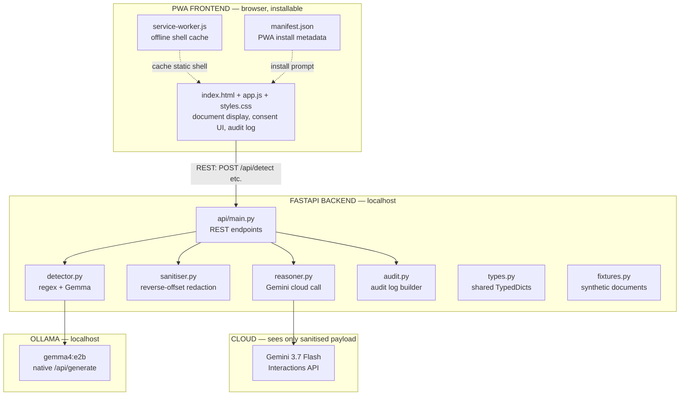

# Privacy Gate — Architecture Spec

**What this is:** system architecture for the Privacy Gate web application with PWA support.
**Implements:** [requirements spec](privacy-gate.md), [design doc](design.md).
**Supersedes:** ADR-003 (Streamlit) — see ADR-010.

---

## 1. Architecture overview



**Key change from design doc:** the Streamlit monolith is replaced by a FastAPI backend serving a static PWA frontend. The core Python modules (detector, sanitiser, reasoner, audit, types, fixtures) are unchanged — they are pure functions that the API layer calls.

**Why:** A web app with PWA support is installable, works offline (the static shell), and is a more impressive demo than a Streamlit script. The backend/frontend split also makes the API testable in isolation — critical for TDD.

---

## 2. Process model

```
User's machine:
  ┌─────────────────────────────────────────────┐
  │  Browser (PWA)                              │
  │    index.html + app.js + styles.css         │
  │    service-worker.js (caches static shell)  │
  │    manifest.json (PWA metadata)             │
  └──────────────┬──────────────────────────────┘
                 │ HTTP (localhost:8000)
  ┌──────────────▼──────────────────────────────┐
  │  FastAPI server (uvicorn)                   │
  │    Serves: static files + /api/* endpoints  │
  └──────┬───────────────┬──────────────────────┘
         │               │
  ┌──────▼─────┐  ┌──────▼──────────────────────┐
  │  Ollama    │  │  Gemini API (cloud)         │
  │  :11434    │  │  via google-genai SDK       │
  │  (local)   │  │  (sanitised payload only)   │
  └────────────┘  └─────────────────────────────┘
```

- **Single process:** FastAPI serves both static files (frontend) and API endpoints from one `uvicorn` process.
- **No separate frontend build step.** Plain HTML/CSS/JS — no React, no bundler, no npm. This is a 2-hour build.
- **PWA:** manifest.json + service worker enable "Add to Home Screen" and offline static shell caching. The API calls still require localhost connectivity (Ollama + FastAPI), but the UI shell loads without network.

---

## 3. Directory structure

```
app/
├── types.py              # Shared TypedDicts (unchanged from design doc)
├── fixtures.py           # Synthetic documents (unchanged)
├── detector.py           # Regex + Gemma detection (unchanged)
├── sanitiser.py          # Reverse-offset redaction (unchanged)
├── reasoner.py           # Gemini cloud call (unchanged)
├── audit.py              # Audit log builder (unchanged)
├── main.py               # CLI entry point (kept for headless testing)
├── api/
│   ├── __init__.py
│   └── main.py           # FastAPI app: static files + REST endpoints
├── static/
│   ├── index.html         # Single-page app
│   ├── app.js             # UI logic: fetch API, render, consent, audit
│   ├── styles.css         # Layout + redaction highlighting
│   ├── manifest.json      # PWA install metadata
│   ├── service-worker.js  # Offline shell cache
│   └── icons/
│       ├── icon-192.png   # PWA icon 192x192
│       └── icon-512.png   # PWA icon 512x512
└── tests/
    ├── __init__.py
    ├── conftest.py         # Pytest fixtures: client, mock Ollama, mock Gemini
    ├── test_detector.py    # TDD tests for detector.py
    ├── test_sanitiser.py   # TDD tests for sanitiser.py
    ├── test_reasoner.py    # TDD tests for reasoner.py
    ├── test_audit.py       # TDD tests for audit.py
    ├── test_api.py         # TDD tests for API endpoints
    └── test_e2e.py         # End-to-end flow test
```

**Key points:**
- Core modules (`types.py` through `audit.py`) are unchanged from the design doc — pure functions, no web framework dependency.
- `api/main.py` is the only new Python code — a thin FastAPI wrapper that calls the existing modules.
- `static/` is the PWA frontend — plain HTML/CSS/JS, no build step.
- `tests/` is first-class — TDD means tests are written before implementation.

---

## 4. Layer responsibilities

### 4.1 Frontend (PWA) — `static/`

| Component | Responsibility |
|---|---|
| `index.html` | Document structure: header, document selector, document display, detect button, highlight area, consent checkboxes, sanitised payload preview, send button, Gemini output, audit log |
| `app.js` | State management, API calls (fetch), rendering, consent toggle, stage gating |
| `styles.css` | Layout, colours, redaction highlight styles (`.redacted`, `.shared`, `.blocked`) |
| `manifest.json` | PWA metadata: name, icons, display mode, theme colour |
| `service-worker.js` | Cache static shell (index.html, app.js, styles.css, icons) for offline load |

**Frontend state machine:**
```
IDLE → DOCUMENT_SELECTED → DETECTING → DETECTED → CONSENT_PENDING
  → SANITISING → SANITISED → REASONING → COMPLETE
```

Each state enables/disables the appropriate buttons. State is held in `app.js` (plain JS object, no framework).

**Privacy boundary in the frontend:** the frontend never sends original document text to any external service. It sends text only to `POST /api/detect` (localhost). The backend ensures only the sanitised payload reaches Gemini.

### 4.2 API layer — `api/main.py`

| Endpoint | Method | Purpose | Spec FR |
|---|---|---|---|
| `/` | GET | Serve `index.html` | — |
| `/static/{path}` | GET | Serve static files | — |
| `/api/documents` | GET | List available fixture documents | FR-1, FR-2 |
| `/api/detect` | POST | Run detection on a document, return spans | FR-4–FR-11 |
| `/api/sanitise` | POST | Produce sanitised payload from spans + consent | FR-15 |
| `/api/reason` | POST | Send sanitised payload to Gemini, return analysis | FR-17–FR-21 |
| `/api/audit` | POST | Build audit log from spans + consent + detection results | FR-22 |

**Why separate endpoints instead of one pipeline call:** each stage is a user-initiated step in the UI. The user must see the spans, approve consent, and see the sanitised payload before anything goes to Gemini. A single pipeline endpoint would skip the human gate (violating FR-14).

**API statelessness:** the API is stateless. Each request carries the data it needs (document text, spans, consent decision). No server-side session. The frontend holds state between calls.

### 4.3 Core modules — minor addition

`types.py`, `fixtures.py`, `detector.py`, `reasoner.py`, `audit.py` are identical to the design doc — pure functions, no changes. `sanitiser.py` gains one additional function: `sanitise_multi()` (already defined in design doc §3.4) which handles multi-document concatenation. The API layer always calls `sanitise_multi()` — even for a single document, the payload is wrapped with the `--- DOCUMENT: X ---` delimiter. This simplifies the API (one code path) and is consistent with the response examples in the API spec. No other module changes.

### 4.4 External services

| Service | Address | Network | Purpose |
|---|---|---|---|
| Ollama | `localhost:11434` | local | Gemma 4 E2B inference |
| Gemini API | `generativelanguage.googleapis.com` | cloud | Gemini 3.7 Flash reasoning |
| FastAPI | `localhost:8000` | local | Serves frontend + API |

---

## 5. PWA configuration

### 5.1 manifest.json
```json
{
  "name": "Privacy Gate",
  "short_name": "PrivacyGate",
  "description": "Assisted redaction with human approval",
  "start_url": "/",
  "display": "standalone",
  "background_color": "#111214",
  "theme_color": "#1a7f4b",
  "icons": [
    {"src": "/static/icons/icon-192.png", "sizes": "192x192", "type": "image/png"},
    {"src": "/static/icons/icon-512.png", "sizes": "512x512", "type": "image/png"}
  ]
}
```

### 5.2 service-worker.js
- Caches the static shell on install: `index.html`, `app.js`, `styles.css`, `manifest.json`, icons.
- Serves from cache on fetch when offline (cache-first strategy for static assets).
- Does NOT cache API responses — those require the local server.
- Registration: `navigator.serviceWorker.register('/service-worker.js')` in `index.html`. The service worker is served at root (not `/static/`) so its scope covers `/` — a service worker at `/static/service-worker.js` can only intercept `/static/*`, not the root navigation request.

### 5.3 What "offline" means for this PWA
- The **UI shell** loads offline (cached by service worker).
- The **API calls** require the FastAPI server running on localhost — which in turn requires Ollama for detection and internet for Gemini.
- The **detection step** works with wifi off (Ollama is local) but requires the FastAPI server to be running.
- The **reasoning step** requires internet (Gemini API).
- PWA installability is the primary demo value: "Add to Home Screen" makes it feel like a real app, not a web page.

---

## 6. Dependencies

### 6.1 Python (additions to `starter/requirements.txt`)
```
fastapi>=0.115.0
uvicorn[standard]>=0.30.0
httpx>=0.27.0
pytest>=8.0.0
pytest-asyncio>=0.23.0
```

- `fastapi` — API framework
- `uvicorn` — ASGI server
- `httpx` — async HTTP client (used by TestClient for API tests)
- `pytest` + `pytest-asyncio` — test runner for TDD

### 6.2 Frontend
No build tools. Plain HTML/CSS/JS. No npm, no bundler.

### 6.3 PWA icons
Two placeholder PNG icons (192×192 and 512×512). Can be generated with any tool or be simple solid-colour squares with a "PG" label for the hackathon.

---

## 7. Startup and run commands

```bash
# Install deps
pip install -r starter/requirements.txt

# Set up environment
cp starter/.env.example .env
# Edit .env: GEMINI_API_KEY=...

# Pull local model
ollama pull gemma4:e2b

# Run tests (TDD — write tests first, then implement)
pytest app/tests/ -v

# Start the server
uvicorn app.api.main:app --reload --port 8000

# Open the app
open http://localhost:8000
```

---

## 8. Demo deployment

| Step | Command |
|---|---|
| Warm the model | `ollama run gemma4:e2b ""` (during setup) |
| Start the server | `uvicorn app.api.main:app --port 8000` |
| Open the app | `http://localhost:8000` |
| Install as PWA | Chrome → Install → "Privacy Gate" appears as app |

---

## 9. Alignment with existing docs

### 9.1 What changes from the design doc

| Design doc says | Architecture spec says | Why |
|---|---|---|
| Streamlit `app.py` orchestrates everything | FastAPI `api/main.py` + static frontend | Web app + PWA requirement |
| Session state in `st.session_state` | State in frontend `app.js` | No server-side session |
| One monolithic file (`app.py`) | API layer + frontend split | Testable API, installable PWA |
| No test framework | `pytest` with TDD | Testing spec requirement |

### 9.2 What stays the same

- Core modules: `types.py`, `fixtures.py`, `detector.py`, `sanitiser.py`, `reasoner.py`, `audit.py` — unchanged.
- Data contracts: `Span`, `DetectionResult`, `ConsentDecision`, `AuditEntry`, `GeminiResult` — unchanged.
- Algorithms: two-pass merge, best-match offsets, reverse-offset redaction, JSON fence stripping — unchanged.
- Prompts, regex patterns, fixtures — unchanged.
- Privacy boundary: originals never leave the device — unchanged.

### 9.3 Spec impact

The requirements spec (FR-12, FR-16) references "Streamlit" — these are updated to "web UI". FR-12 says "colour-coded by type in Streamlit" → "colour-coded by type in the web UI". No functional requirement changes.

---

## 10. Security boundaries

```
┌─────────────────────────────────────────────────────────────┐
│ BROWSER (PWA)                                               │
│   Can: display documents, call localhost API                │
│   Cannot: call Gemini directly, call Ollama directly        │
└──────────────────────┬──────────────────────────────────────┘
                       │ localhost only
┌──────────────────────▼──────────────────────────────────────┐
│ FASTAPI BACKEND                                             │
│   Can: call Ollama (local), call Gemini (cloud)             │
│   Enforces: only sanitised payload sent to Gemini           │
│   Never logs: API keys, original document text              │
└──────┬───────────────────────────────┬──────────────────────┘
       │ localhost                     │ HTTPS
┌──────▼──────────┐           ┌────────▼──────────────────────┐
│ OLLAMA (local)  │           │ GEMINI API (cloud)            │
│ Sees: full text │           │ Sees: sanitised payload ONLY  │
└─────────────────┘           └───────────────────────────────┘
```

- The browser never has the Gemini API key. All cloud calls go through the FastAPI backend.
- The backend never sends original text to Gemini. The sanitiser runs before `reasoner.py` is called.
- Ollama sees the full text — it's local, that's the point.

---

## Related

- [UI spec](ui.md) — live screens and JSON the frontend already consumes
- [Requirements spec](privacy-gate.md) — functional requirements
- [Design doc](design.md) — module designs (core modules unchanged)
- [API spec](api.md) — endpoint definitions
- [Testing spec](testing.md) — TDD approach
- [ADR-010](../decisions/010-fastapi-pwa.md) — rationale for the architecture shift