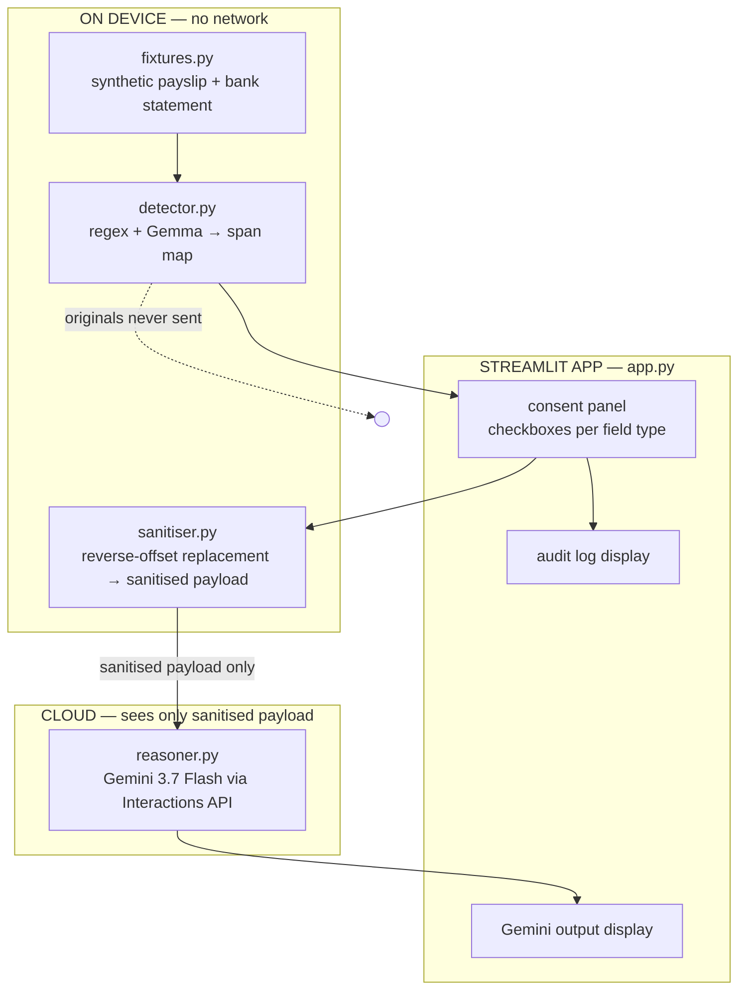
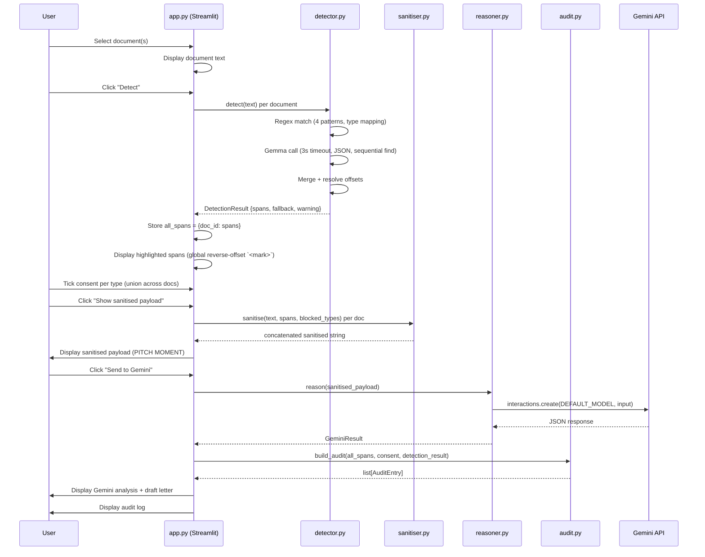

# Privacy Gate — Design Document

**What this is:** the technical design that implements the [requirements spec](../specs/privacy-gate.md).
**Status:** **Partially superseded.** The detector/sanitiser/reasoner/audit algorithms (§3.3-§3.6) and merge logic are still the source of truth for backend module implementation. The Streamlit UI section (§3.7), module map (§2), system diagram (§1), data flow (§4), dependency graph (§5), build instructions (§7), testing (§8), and demo run-sheet (§9) are **obsolete** — use [architecture.md](architecture.md), [ui.md](ui.md), [testing.md](testing.md), and [development-plan.md](development-plan.md) instead.
**Key superseded areas:**
- §3.1 types.py: 5 types → 9 types (ADR-011), `text` → `value`, binary consent → 3-state (ADR-012)
- §3.4 sanitiser: `[REDACTED]` → `█`/`[ENCRYPTED]`, `blocked_types` → `toggles`
- §3.7 app.py: Streamlit → FastAPI + multi-page PWA (ADR-010, ADR-013)
- §8 testing: "no test framework" → pytest TDD (see testing.md)
**Build window:** ~2 hours, agent-driven.

---

## 1. System overview



Three local modules, one Streamlit app, one cloud call. Each module is a pure function except the cloud call. The Streamlit app orchestrates the flow and owns all state.

---

## 2. Module map

```
app/
├── app.py            Streamlit UI — the orchestrator and only stateful component
├── fixtures.py       Synthetic document strings (spec §7)
├── detector.py       Regex + Gemma detection → span map (spec §2.2, §3.1-3.2)
├── sanitiser.py      Span merge + reverse-offset redaction (spec §3.4, §3.6)
├── reasoner.py       Gemini cloud call (spec §2.4, §3.7, §9.2)
├── audit.py          Audit log builder (spec §2.5, §3.8)
└── pipeline.py       (existing — replaced by app.py orchestration)
```

Each module is independently buildable by a separate agent against the data contracts in the spec. The only shared types are `Span`, `ConsentDecision`, `AuditEntry` — defined in a small `types.py`.

```
app/
├── types.py          TypedDicts shared across modules
└── ... (as above)
```

---

## 3. Component designs

### 3.1 `types.py` — shared types

```python
from typing import TypedDict, Literal

FieldType = Literal["name", "address", "ni_number", "account_number", "income"]

class Span(TypedDict):
    type: str        # FieldType
    start: int       # zero-based, inclusive
    end: int         # zero-based, exclusive
    text: str        # matched substring for verification

class DetectionResult(TypedDict):
    spans: list[Span]
    fallback_triggered: bool    # True if Gemma timed out / failed → regex-only
    warning: str                 # human-readable warning if fallback or parse errors

class ConsentDecision(TypedDict):
    shared_types: list[str]
    blocked_types: list[str]

class AuditEntry(TypedDict):
    field_type: str
    decision: str        # "kept_local" | "shared" | "fallback"
    approved_by: str     # "user" for consent decisions, "system" for fallback entries
    details: str         # empty for normal entries; warning text for fallback entries

class GeminiResult(TypedDict):
    inconsistency_detected: bool
    analysis: str
    draft_letter: str
```

**Why `DetectionResult` instead of bare `list[Span]`:** spec FR-10 requires a fallback warning to reach the audit trail. A bare list has no channel for that metadata. `DetectionResult` carries `fallback_triggered` and `warning` through to `app.py` and `audit.py`.

**Alignment:** matches spec §3.1, §3.3, §3.7, §3.8. Extends spec §3.8 with a fallback-warning audit entry (see §3.6 below).

### 3.2 `fixtures.py` — synthetic documents

```python
PAYSLIP = """\
PAYSLIP — July 2026
Employee: A. Okafor
NI Number: QQ123456C
Address: 14 Pelham St, London SW7 2AZ
Bank Account: 12345678
Sort Code: 12-34-56

Gross Pay: £2,840.00
Tax Deducted: £412.60
Net Pay: £2,427.40

Employer: Pelham Consulting Ltd
Pay Date: 25 July 2026
"""

BANK_STATEMENT = """\
BANK STATEMENT — Account 12345678
Sort Code: 12-34-56
Statement Period: 01 Jul 2026 – 31 Jul 2026

Date       Description              Amount
25 Jul 26  PELHAM CONSULTING PAY    £2,480.00
28 Jul 26  RENT PELHAM ST           -£1,200.00
30 Jul 26  SAINSBURY'S              -£84.32

Balance: £1,195.68
"""

DOCUMENTS = {"payslip": PAYSLIP, "bank_statement": BANK_STATEMENT}
```

**Alignment:** spec §7.1 and §7.2, verbatim. The planted inconsistency: net pay £2,427.40 vs deposit £2,480.00 (£52.60 difference).

### 3.3 `detector.py` — sensitive-field detection

```python
def detect(text: str) -> DetectionResult:
    """Pure function. Regex first, then Gemma. Merges results, resolves offsets.
    Returns DetectionResult with spans + fallback metadata."""
    regex_spans = _detect_regex(text)
    gemma_spans, fallback, warning = _detect_gemma(text)
    spans = _merge_spans(regex_spans + gemma_spans)
    return DetectionResult(spans=spans, fallback_triggered=fallback, warning=warning)
```

**Type mapping table** (resolves the regex/postcode and Gemma/date mismatches):

| Source | Raw type | Maps to `FieldType` | Action |
|---|---|---|---|
| regex | `ni_number` | `ni_number` | direct |
| regex | `postcode` | `address` | **rename** — postcode is part of address |
| regex | `email` | `address` | **rename** — email is contact info, same consent default (blocked) |
| regex | `account_number` | `account_number` | direct |
| Gemma | `name` | `name` | direct |
| Gemma | `address` | `address` | direct |
| Gemma | `income` | `income` | direct |
| Gemma | `date` | — | **drop** — dates are not sensitive; not in the 5 field types |
| Gemma | (any other) | — | **drop** — unknown types ignored |

This mapping is applied in `_detect_regex` and `_detect_gemma` respectively, before spans are returned. No downstream component ever sees `postcode`, `email`, or `date` as a type.

**Regex sub-step** (`_detect_regex`):
- Uses the 4 patterns from spec §8. The `account_number` pattern is replaced with a context-aware regex to avoid false positives on dates/amounts: `r'(?i)(?:account(?:\s+number)?[:\s—–-]+)(\d{8})\b'` — matches "Bank Account: 12345678" and "Account 12345678" but not standalone 8-digit numbers. Extract group 1 for the span text.
- For each match, produces a `Span` with `type` (after mapping), `start`, `end`, and `text`. Use `match.span(1) if match.lastindex else match.span(0)` for offsets and `match.group(1) if match.lastindex else match.group(0)` for text — `account_number` has a capture group, the other 3 patterns don't.

**Gemma sub-step** (`_detect_gemma`):
- Calls Ollama native `/api/generate` with `model=gemma4:e2b`, `think=false`, `num_predict=200`, `format="json"` (spec §9.1).
- System prompt from spec §9.1. Document text inserted at `<DOCUMENT TEXT HERE>`.
- **3-second timeout** (spec NFR-5, ADR-006). On timeout or error → return `([], True, "Local model unavailable — used regex-only detection.")`.
- Parses JSON defensively (spec FR-11). Concrete strategy:
  1. Strip markdown wrappers: `response.strip().strip('`').replace('```json', '').replace('```', '').strip()`
  2. Extract the outermost JSON array: find first `[` and last `]`, slice the substring.
  3. Try `json.loads(substring)`.
  4. If that fails, fall back to regex-extracting individual objects: `re.findall(r'\{[^}]+\}', substring)` and parse each with `json.loads`. Drop any that fail.
  5. If all parsing fails, return `([], True, "Gemma output could not be parsed — used regex-only detection.")`.
- Gemma returns `[{text, type}]`. Python resolves offsets via **best-match `str.find()`**:
  - Do NOT use a monotonic `search_from` pointer — Gemma may return fields out of document order.
  - Instead, for each Gemma item, call `text.find(item["text"])`. If the substring appears once, use that position.
  - If the substring appears multiple times, pick the occurrence not yet claimed by a previous span. Track claimed intervals `[(start, end)]`; for each new item, find the first occurrence whose position doesn't overlap any claimed interval.
  - If no unclaimed occurrence is found (`-1` or all occurrences claimed): drop the span, append to warning string.
  - This handles both out-of-order returns and repeated substrings (e.g. "Pelham" appears 3× in the fixtures).
- Apply the type mapping table above. Drop `date` and unknown types.

**Merge sub-step** (`_merge_spans`):
- Implements spec §3.6 / ADR-002. **Two-pass algorithm** (matches spec §3.6's separation of concerns):
  ```
  Pass 1 — same-type merge:
    1. Group spans by type.
    2. Within each group, sort by start ascending.
    3. Merge overlapping/nested spans in the group: iterate, if curr.start < prev.end, merge (prev.end = max(prev.end, curr.end)).
    4. Collect all merged-per-type spans into one list.

  Pass 2 — cross-type resolution:
    5. Sort the merged spans by (start ascending, end descending). For equal start, larger end comes first.
    6. Iterate sequentially. Maintain a result list.
    7. For each span S: if S overlaps the last span in result (S.start < last.end):
       - If same type: merge (shouldn't happen after pass 1, but safe).
       - If different type: keep the one with larger (end - start). If equal length, keep the one already in result (first-come). Drop the other.
       - If S is kept and last is dropped: replace last with S.
    8. If S does not overlap last, append S to result.
    9. Return result.
  ```
  **Worked example:** spans = `[(0,10,address), (8,14,postcode→address), (8,20,name)]`
  - Pass 1: address group = `[(0,10), (8,14)]` → sorted → `(0,10)` and `(8,14)` overlap → merge → `(0,14,address)`. Name group = `[(8,20)]`. Merged list: `[(0,14,address), (8,20,name)]`.
  - Pass 2: sort by (start asc, end desc) → `[(0,14,address), (8,20,name)]`.
  - S=(0,14,address): result empty → append. Result=`[(0,14,address)]`.
  - S=(8,20,name): overlaps (0,14)? 8 < 14 → yes. Different type. len(address)=14, len(name)=12. Keep address. Drop name.
  - Final: `[(0,14,address)]`.

**Alignment:** spec FR-4 through FR-11, §3.6, §8, §9.1. ADR-001, ADR-002, ADR-006.

### 3.4 `sanitiser.py` — redaction

```python
def sanitise(text: str, spans: list[Span], blocked_types: list[str]) -> str:
    """Pure function. Replaces blocked spans with [REDACTED] in reverse offset order."""
```

**Algorithm:**
1. Filter `spans` to those whose `type` is in `blocked_types`.
2. Sort filtered spans by `start` descending (reverse order).
3. For each span, replace `text[start:end]` with `[REDACTED]`.
4. Return the result string.

Because we go right-to-left, earlier offsets are never shifted by earlier replacements (ADR-002).

**Multi-document variant** (if FR-3 is built):
```python
def sanitise_multi(documents: dict[str, str], all_spans: dict[str, list[Span]],
                   blocked_types: list[str]) -> str:
    """Sanitises each document, concatenates with delimiter (spec §3.5)."""
    parts = []
    for doc_id, text in documents.items():
        sanitised = sanitise(text, all_spans[doc_id], blocked_types)
        parts.append(f"--- DOCUMENT: {doc_id.upper()} ---\n{sanitised}")
    return "\n\n".join(parts)
```

**Alignment:** spec FR-15, §3.4, §3.5, §3.6. ADR-002.

### 3.5 `reasoner.py` — cloud reasoning

```python
def reason(payload: str) -> GeminiResult:
    """Calls Gemini 3.7 Flash via Interactions API. Uses retry-with-backoff."""
```

**Implementation:**
- Uses `starter/utils.py:get_client()`, `DEFAULT_MODEL`, and `with_retry()` (already built, spec NFR-6).
- Constructs the prompt from spec §9.2, inserting the sanitised payload at `<SANITISED PAYLOAD HERE>`.
- Calls `client.interactions.create(model=DEFAULT_MODEL, input=prompt)`. Uses the constant from `utils.py`, not a hardcoded string — single source of truth for the model ID.
- Parses the response text as JSON into `GeminiResult`. **Concrete parsing strategy** (same defensive approach as detector.py):
  1. Strip markdown code fences: `response.strip().strip('`').replace('```json', '').replace('```', '').strip()`
  2. Extract the outermost JSON object: find first `{` and last `}`, slice the substring.
  3. Try `json.loads(substring)`.
  4. If that fails, return a fallback `GeminiResult` with `inconsistency_detected=False`, `analysis=raw_response_text`, `draft_letter=""`.
  - Gemini almost always wraps JSON in ```` ```json ``` ```` fences — without stripping, `json.loads` fails 100% of the time.
- **Original text never enters this function.** It only receives the sanitised payload string (spec FR-18).

**Alignment:** spec FR-17 through FR-21, §3.7, §9.2. NFR-6.

### 3.5a `reasoner.chat()`, conversation (STRETCH)

```python
def chat(payload: str, history: list[dict], message: str) -> ChatResult:
    """Free-form Q&A over the sanitised payload. Never receives original text."""
```

**Implementation:**
- Same client, model constant and retry wrapper as `reason()`.
- Builds `input` as the sanitised payload, then prior turns, then the new message.
- System instruction must state that redaction markers are deliberate withholdings, that the model says plainly when it cannot see a field, and that it never guesses at removed content.
- Returns `ChatResult(reply: str, cited_fields: list[str], refused_field_types: list[str])`.
- Same defensive JSON parsing as `reason()`. On a parse failure, return the raw text as `reply` with both lists empty, rather than raising.
- **Original text never enters this function.** It takes a string payload, the same boundary as `reason()` (spec FR-18, FR-40).

**Alignment:** spec FR-40 through FR-43, api.md §2.6.

### 3.6 `audit.py` — audit log

```python
def build_audit(all_spans: dict[str, list[Span]], decision: ConsentDecision,
                detection_results: dict[str, DetectionResult] | None = None) -> list[AuditEntry]:
    """One entry per field type (union across documents). Plus fallback entries if triggered."""
```

**Implementation:**
- Flatten all span lists from `all_spans` (union across documents) to extract the set of field types.
- For each type, create an `AuditEntry` with `decision="shared"` if type is in `decision["shared_types"]`, else `"kept_local"`. `approved_by="user"`, `details=""`.
- If `detection_results` is passed, check each document's result. For any with `fallback_triggered=True`, add a special entry:
  `AuditEntry(field_type="detector", decision="fallback", approved_by="system", details=result["warning"])`.
- Returns a list of `AuditEntry` dicts.

**Alignment:** spec FR-22, FR-23, FR-10, §3.8.

### 3.7 `app.py` — Streamlit orchestration

The only stateful component. Owns session state and drives the pipeline.

**Session state:**
```python
# All span state is dict[doc_id, list[Span]] — uniform for 1-doc and 2-doc modes
st.session_state.all_spans            # dict[str, list[Span]] or None
st.session_state.detection_results    # dict[str, DetectionResult] or None (per-doc fallback status)
st.session_state.consent_done         # bool
st.session_state.result               # GeminiResult or None
st.session_state.audit                # list[AuditEntry] or None
st.session_state.preview_shown        # bool — persists across button clicks (Streamlit reruns)
```

**Uniform multi-document state:** single-document mode is `{"payslip": PAYSLIP}` — a dict with one entry. Two-document mode is `{"payslip": PAYSLIP, "bank_statement": BANK_STATEMENT}`. All downstream components (`detector`, `sanitiser`, `audit`) operate on `dict[str, list[Span]]` uniformly. No branching logic between 1-doc and 2-doc modes.

**Consent checkbox generation:** union all field types across all documents' span lists. One checkbox per unique type. Consent is per-type globally (spec §3.5).

**UI layout (top to bottom):**

1. **Header:** "Privacy Gate — assisted redaction with human approval"
2. **Document selector:** radio buttons — "Payslip only" / "Payslip + Bank Statement" (spec FR-3, SHOULD)
3. **Document display:** shows the selected document(s) in a text area (read-only)
4. **Detect button:** "Detect sensitive fields" → calls `detect()` for each document → stores `DetectionResult` and `all_spans` in session state
5. **Highlight display:** shows the document with spans highlighted. **Approach:** global reverse-offset `<mark>` insertion — identical algorithm to `sanitiser.py` but inserting `<mark style="background-color:...">text</mark>` instead of `[REDACTED]`. Wrap in `<div style="white-space: pre-wrap; font-family: monospace;">`. Process spans in reverse offset order so earlier offsets aren't shifted. Do NOT split by lines (global offsets don't map to line-local indices without error-prone bookkeeping). Colour: red (`#ffcccc`) = blocked default (name/address/ni_number/account_number), green (`#ccffcc`) = shared default (income). Render via `st.markdown(html, unsafe_allow_html=True)`.
6. **Consent checkboxes:** one per detected field type (union across documents), pre-set to defaults from spec §4 (name/address/ni_number/account_number = blocked, income = shared)
7. **Sanitise + preview button:** "Show sanitised payload" → calls `sanitise()` per document → displays the concatenated sanitised payload in a text area (spec FR-16 — the pitch moment)
8. **Send button:** "Send approved to Gemini" → calls `reason()` → displays `GeminiResult` (spec FR-20, FR-21)
9. **Audit log:** displayed after the cloud call, showing what stayed local and what was shared (spec FR-22, FR-23)

**Stage gating (spec FR-25, FR-26):**
- Detect button is disabled until a document is selected.
- Sanitise button is disabled until detection has run.
- Send button is disabled until the user has seen the sanitised payload and at least one type is shared. If all types are blocked, show a warning and disable the send button (spec FR-26). This applies to both Streamlit and CLI.

**Error handling:**
- If `detect()` returns empty spans, show "No sensitive fields detected" and allow proceeding with no redaction.
- If `reason()` fails after retries, show the error and display the sanitised payload as-is (the user still has the redacted output).
- If `detection_results` has any entry with `fallback_triggered=True`, show a warning banner with that result's `warning` text and add the fallback entry to the audit log (spec FR-10).

**Alignment:** spec FR-12 through FR-16, FR-22 through FR-26, §5 (demo flow). ADR-003 (Streamlit). Note: `get_consent()` from spec §3.9 is inlined as Streamlit checkbox state in `app.py`, not a standalone function — the UI IS the consent function.

---

## 4. Data flow (end-to-end)



---

## 5. Dependency graph (for parallel agent assignment)

```
types.py          ← no deps, build first (5 min)
    ↓
fixtures.py       ← no deps (5 min)
    ↓
detector.py       ← depends on types.py (30 min — most complex)
sanitiser.py      ← depends on types.py (15 min)
audit.py          ← depends on types.py (10 min)
reasoner.py       ← depends on types.py + starter/utils.py (15 min)
    ↓
app.py            ← depends on ALL above (30 min — integration)
```

**Parallel tracks after types.py + fixtures.py are done:**
- Track A: `detector.py` (longest, start first)
- Track B: `sanitiser.py` + `audit.py` (short, one agent can do both)
- Track C: `reasoner.py` (uses existing starter code)
- Track D: `app.py` shell (can build the UI layout with mock data while others work)

**Critical path:** types.py → detector.py → app.py integration. ~65 min of the 120 min budget.

---

## 6. Reuse of existing code

| Existing file | What we reuse | How |
|---|---|---|
| `starter/utils.py` | `get_client()`, `DEFAULT_MODEL`, `with_retry()` | Import in `reasoner.py`. No modification. |
| `starter/.env.example` | `GEMINI_API_KEY` template | Copy to project root `.env`. |
| `app/pipeline.py` | `local_step()` Ollama call pattern | Refactor into `detector.py:_detect_gemma()`. Add 3s timeout, `format="json"`, new prompt. |
| `app/pipeline.py` | `gemini_step()` call pattern | Refactor into `reasoner.py`. Add JSON response parsing. |
| `app/main.py` | CLI entry point | **Replace** with `app.py` (Streamlit). Keep `main.py` as a CLI fallback for headless testing. |

**What we do NOT reuse:**
- `pipeline.py:run()` — the generic classify→answer flow is replaced by the real product logic.
- `pipeline.py:local_step()` instruction param — the detector has a fixed prompt (spec §9.1).

---

## 7. File-by-file build instructions (for agents)

Each file is a self-contained task an agent can build from.

### 7.1 `app/types.py`
- Define the 5 TypedDicts in §3.1 above (`Span`, `DetectionResult`, `ConsentDecision`, `AuditEntry`, `GeminiResult`) and the `FieldType` literal.
- No imports except `typing`.
- ~25 lines.

### 7.2 `app/fixtures.py`
- Paste the two document strings from spec §7.
- Define `DOCUMENTS` dict.
- ~30 lines.

### 7.3 `app/detector.py`
- Import `types.py`, `re`, `json`, `urllib.request`, `os`.
- Implement `_detect_regex(text) -> list[Span]` using spec §8 patterns. Apply type mapping table (postcode→address, email→address).
- Implement `_detect_gemma(text) -> (list[Span], bool, str)` using spec §9.1 prompt, sequential `str.find()` offset resolution (D-4), 3s timeout, defensive JSON parsing (5-step strategy in §3.3). Apply type mapping (date→dropped).
- Implement `_merge_spans(spans) -> list[Span]` per the formal algorithm in §3.3.
- Implement `detect(text) -> DetectionResult` as the public entry point.
- ~100 lines.

### 7.4 `app/sanitiser.py`
- Import `types.py`.
- Implement `sanitise(text, spans, blocked_types) -> str` per spec §3.4, §3.6.
- Implement `sanitise_multi(documents, all_spans, blocked_types) -> str` per spec §3.5 (if FR-3 is built).
- ~25 lines.

### 7.5 `app/reasoner.py`
- Import `types.py`, `starter/utils.py`.
- Implement `reason(payload) -> GeminiResult` using spec §9.2 prompt, `client.interactions.create()`, JSON parsing with fallback.
- Apply `@with_retry()` from utils.
- ~30 lines.

### 7.6 `app/audit.py`
- Import `types.py`.
- Implement `build_audit(all_spans: dict[str, list[Span]], decision: ConsentDecision, detection_results: dict[str, DetectionResult] | None = None) -> list[AuditEntry]`.
- Flatten `all_spans.values()` to extract field types. Check `any(r["fallback_triggered"] for r in detection_results.values())` for fallback entries.
- ~25 lines.

### 7.7 `app/app.py`
- Import Streamlit + all modules above.
- Build the 9-section UI from §3.7.
- Manage session state.
- Wire buttons to functions.
- ~120 lines.

### 7.8 `app/main.py` (CLI fallback)
- Keep the existing CLI structure but wire it to the real modules.
- `detect → print spans → (auto-block defaults) → sanitise → reason → print result + audit`.
- Useful for headless testing without Streamlit.
- ~40 lines.

---

## 8. Testing strategy (lightweight, for a hackathon)

No test framework. Manual verification + one smoke test.

### 8.1 Smoke test (CLI)
```bash
python app/main.py          # runs the full pipeline on the payslip fixture
```
Expected: spans detected, sanitised payload printed, Gemini response with inconsistency, audit log printed.

### 8.2 Manual checks (Streamlit)
1. Load app → document visible.
2. Click detect → spans highlighted in colour.
3. Tick/untick → sanitised payload updates.
4. Verify `[REDACTED]` appears in the right places.
5. Send to Gemini → analysis mentions the £52.60 inconsistency.
6. Audit log shows correct kept_local/shared per type.

### 8.3 Edge cases to verify
- Gemma unreachable → regex-only fallback works, warning shown.
- All types blocked → send button disabled.
- No types detected → empty span list, no redaction, Gemini sees full document (edge case, but honest).

---

## 9. Demo run-sheet

| Time | Action | What the audience sees |
|---|---|---|
| 0:00 | App is open, payslip + bank statement loaded | Two documents on screen |
| 0:15 | Click "Detect" | Fields highlight: name, NI, address, account (red), income (green) |
| 0:30 | Tick: share income, hide the rest | Checkboxes flip |
| 0:40 | Click "Show sanitised payload" | **PITCH MOMENT** — `[REDACTED]` visible where name/NI/address/account were, income figures visible |
| 0:55 | Click "Send to Gemini" | Spinner, then Gemini's analysis: "net pay £2,427.40 but deposit £2,480.00 — £52.60 difference" |
| 1:20 | Show draft letter | Gemini's draft explanation letter |
| 1:40 | Show audit log | What stayed local vs what was shared |
| 2:00 | Done | |

---

## 10. Requirements traceability

| Spec FR | Design component |
|---|---|
| FR-1, FR-2 | `fixtures.py`, `app.py` document selector |
| FR-3 | `app.py` radio buttons, `sanitiser.py:sanitise_multi()` |
| FR-4, FR-5, FR-6, FR-7, FR-8, FR-9, FR-10, FR-11 | `detector.py` |
| FR-12, FR-13, FR-14, FR-15, FR-16 | `app.py` consent + sanitise sections |
| FR-17, FR-18, FR-19, FR-20, FR-21 | `reasoner.py` |
| FR-22, FR-23, FR-24 | `audit.py`, `app.py` audit display |
| FR-25, FR-26 | `app.py` stage gating |
| NFR-1 | `detector.py` (no network in regex path) |
| NFR-2 | `app.py` → `reasoner.py` (only sanitised payload passed) |
| NFR-3 | `detector.py:_detect_gemma()` (num_predict=200, format=json) |
| NFR-4 | Demo setup (warm model) |
| NFR-5 | `detector.py:_detect_gemma()` (3s timeout) |
| NFR-6 | `reasoner.py` (@with_retry from utils) |
| NFR-7 | No `.env` committed; `starter/utils.py` reads key from env |
| NFR-8 | `fixtures.py` (hardcoded strings) |

---

## 11. Resolved design questions

| # | Question | Resolution |
|---|---|---|
| D-1 | Highlight spans using inline HTML or native highlighting? | **Global reverse-offset `<mark>` insertion** in a `pre-wrap` div (see D-9). Do NOT split by lines. |
| D-2 | CLI auto-apply default consent or prompt? | Auto-apply defaults (income shared, rest blocked), print the decision. |
| D-3 | Structured JSON from Gemini SDK or parse text response? | Parse text response — simpler, matches `output_text` pattern in existing code. If parsing is unreliable, switch to structured output param. |
| D-4 | `str.find()` collision on repeated substrings? | **Best-match with claimed-interval tracking** — for each Gemma item, find the first unclaimed occurrence. Handles both repeated substrings and out-of-order returns. |
| D-5 | Regex `postcode`/`email` vs canonical `FieldType`? | **Type mapping table** in `detector.py`: postcode→address, email→address, date→dropped. No downstream component sees raw regex types. |
| D-6 | FR-10 fallback warning data path? | `DetectionResult` per document → `detection_results` dict in session state → `build_audit()` adds fallback `AuditEntry` with `details=warning`. |
| D-7 | Multi-doc vs single-doc state shape? | **Uniform `dict[str, list[Span]]`** for all modes. Single-doc is `{"payslip": PAYSLIP}`. No branching logic. |
| D-8 | Span merge transitivity? | **Two-pass algorithm**: pass 1 merges same-type spans globally; pass 2 resolves cross-type overlaps sequentially. No orphaned spans. |
| D-9 | Highlighting with global offsets? | **Global reverse-offset `<mark>` insertion** in a `pre-wrap` div. Same algorithm as sanitiser but inserting HTML tags instead of `[REDACTED]`. No line splitting. |
| D-10 | Streamlit button state loss on rerun? | `st.session_state.preview_shown` persists the "sanitised payload seen" flag across button clicks. |
| D-11 | `account_number` false positives? | **Context-aware regex**: `r'(?i)(?:account(?:\s+number)?[:\s—–-]+)(\d{8})\b'` — only matches after "Account" label. |
| D-12 | Gemini response code fences? | **Strip ` ```json ``` ` fences** before `json.loads` in `reasoner.py`. Same strategy as detector. |

---

## Related

- [UI spec](ui.md) — live frontend contract for backend
- [Requirements spec](../specs/privacy-gate.md) — what this design implements
- [Decisions index](../decisions/index.md) — rationale for architectural choices
- [Idea write-up](../../notes/ideas/privacy-gate.md) — the original concept
- [Visual explainer](../visual/2026-08-22-privacy-gate.html) — diagrams and worked example